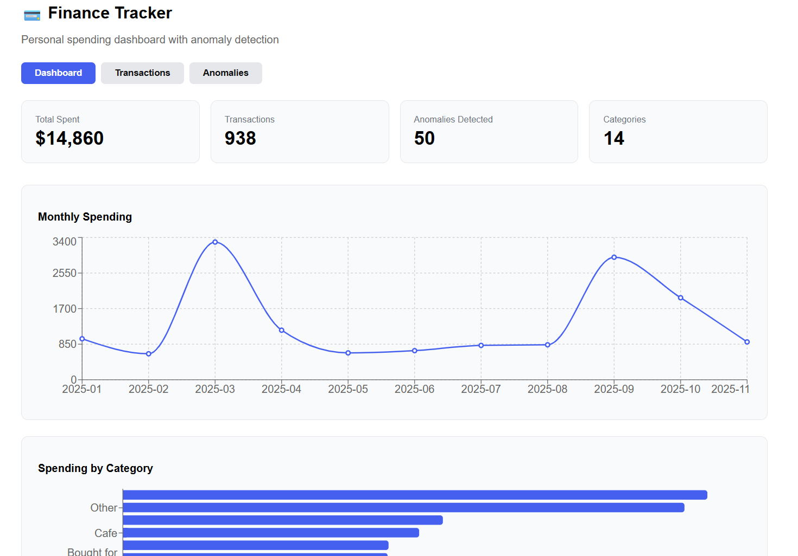

Personal Finance Tracker with Anomaly Detection
A full-stack personal finance dashboard that visualizes spending trends and uses machine learning to flag suspicious transactions.

Features

Spending Dashboard — monthly spending trends and category breakdowns with interactive charts
Transaction Viewer — paginated, sortable transaction history
ML Anomaly Detection — Isolation Forest model flags unusual transactions with human-readable explanations
REST API — FastAPI backend serving clean JSON endpoints

Tech Stack
Backend

Python, FastAPI, Pandas, scikit-learn
Isolation Forest for unsupervised anomaly detection
Feature engineering: transaction amount, account balance, login attempts, time-of-day, days since last transaction

Frontend

React, Recharts
Axios for API calls

Project Structure
finance_tracker/
├── data/
│ ├── raw/ # Original CSV datasets
│ └── processed/ # Cleaned data and anomaly results
├── backend/
│ └── main.py # FastAPI app with /summary, /transactions, /anomalies endpoints
├── frontend/ # React dashboard
├── notebooks/
│ └── explore.ipynb # Data exploration and model development
└── requirements.txt

How It Works
Anomaly Detection
Transactions are scored using scikit-learn's IsolationForest trained on behavioral features:
pythonfeatures = [
'TransactionAmount', 'TransactionDuration', 'LoginAttempts',
'AccountBalance', 'hour', 'day_of_week', 'days_since_last',
'TransactionType_enc', 'Channel_enc'
]
model = IsolationForest(contamination=0.05, random_state=42)
Each flagged transaction receives an explanation based on which thresholds it crossed — high login attempts, unusually large amounts, spending beyond account balance, or off-hours activity.
API Endpoints
EndpointDescriptionGET /summaryTotal spent, by-category and by-month breakdownsGET /transactionsPaginated transaction listGET /anomaliesFlagged transactions sorted by anomaly score

Getting Started

1. Clone the repo
   bashgit clone https://github.com/elcode44/finance_anomaly_tracker.git
   cd finance_anomaly_tracker
2. Set up the backend
   bashpython -m venv venv
   venv\Scripts\activate # Windows
   pip install fastapi uvicorn pandas scikit-learn jupyter notebook
3. Run the Jupyter notebook
   Open notebooks/explore.ipynb and run all cells to generate the processed data files.
4. Start the API
   bashcd backend
   uvicorn main:app --reload
   API runs at http://127.0.0.1:8000
5. Start the frontend
   bashcd frontend
   npm install
   npm start
   Dashboard runs at http://localhost:3000

Dataset

Finance data — personal expense records with date, category, and amount
Anomaly data — bank transaction dataset with behavioral features used to train the detection model

Results

2,512 transactions analyzed
126 anomalies detected (5% contamination threshold)
Top signals: high login attempts, large amounts relative to balance, unusual transaction duration.
